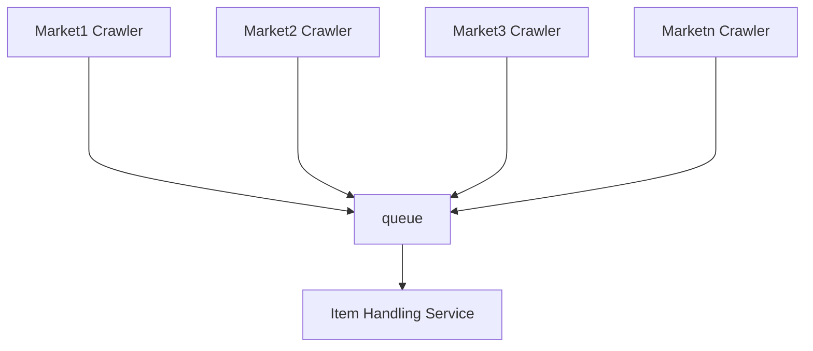

# MarketScrapper
Web crawlers with pre set configurations to scrap prices of Supermarket websites

# What is MarketScrapper
## Architecture

## Summary
MarketScrapper is a predefined set of web crawlers/scrappers that collect article information form specific market websites.
This information is formated and published from the crawlers into a queue, that is then consumed by a Item Handling Service.

### Monitor Docker Compose Redis
To validate incoming notifications we can use:
```shell
docker exec -it marketscrapper_queue_1 redis-cli -h localhost subscribe items
```